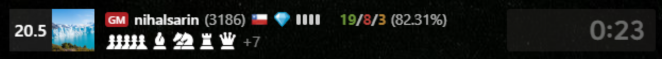

# chess-com-insights

> [!WARNING]  
> This addon is still in development and bugs might occur. If that happens, try to reload the site.  

## 🚀 How it works

This extension shows statistics for chess.com games. 
Use the icon in the top right corner to adjust the settings.

- First three numbers are the wins/loses/draws of the player
- Percentage in brackets is the average accuracy of the player
    - Accuracy is only available on rated games which were reviewed
    - Hover over the stats to see information how many games the average is based on

### Preview

### Options

## ⚙️ Installation

Add the extension to your browser:
[Chrome Web Store](https://chrome.google.com/webstore/detail/chesscom-insights/mobpnhbkmljienoleojnhbfhkhodpffe)

Manual installation:
- Download the latest release zip from [here](https://github.com/thieleju/chess-com-insights/releases)
- Go to your browser and type `chrome://extensions/` in the search bar
- Enable developer mode in the corner
- Drag and drop the zip file into the browser window

## 🪲 Bugs

- Hiding your own stats only hides the bottom stats, currently not depending on the username
- Sometimes the stats flash up when visiting a chess.com game link

If you find any other bugs, please open an issue [here](https://github.com/thieleju/chess-com-insights/issues)

## 💻 Run locally

Prequisites:

- Node.js version 17 or higher 

Instructions:

- Clone/fork/download the project
- run `npm install` to install all dependencies
- run `npm run build` to build the extension
  - Files will be exported to the `dist` folder
  - You can also run `npm run dev` to start the vite dev server to view the options page, but some things f.e. reading the settings will not work
- do the manual installation steps above and select the `dist` folder

## 💯 Code Coverage Report

[Code Coverage Report](https://thieleju.github.io/chess-com-insights/) served with github pages