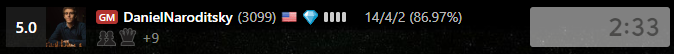

# chess-com-insights

> **Warning**  
> This addon is still in development and bugs might occur. If that happens, try to reload the site.  

## 🚀 How it works

This extension works only on chrome based browsers and is only for chess.com at the moment. It shows stats for both players. 

- First three numbers are the wins/loses/draws of the player 
- Percentage in brackets is the average accuracy of the player
  - Accuracy is only available on games which were reveiwed
- All stats are based on the games of a user in the last 12 hours

## ⚙️ Installation

Add the extension to your browser:
[Chrome Web Store](https://chrome.google.com/webstore/detail/chesscom-insights/mobpnhbkmljienoleojnhbfhkhodpffe)

Manual installation:
- Download the project [here](https://github.com/thieleju/chess-com-insights/archive/refs/heads/main.zip)
- Unzip the file
- Go to your browser and type `chrome://extensions/` in the search bar
- Enable developer mode and click on `Load unpacked`
- Select the folder you just unzipped
- Reload the chess.com page 

## 🪲 Bugs

If you find any bugs, please open an issue [here](https://github.com/thieleju/chess-com-insights/issues)