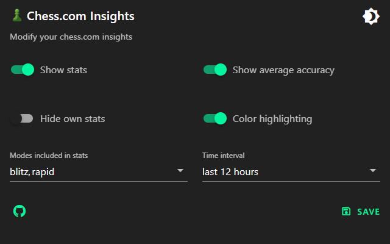

# chess-com-insights

> **Warning**  
> This addon is still in development and bugs might occur. If that happens, try to reload the site.  

## 🚀 How it works

This extension works only on chrome based browsers and is only for chess.com at the moment. It shows stats for both players. Adjust your settings by clicking the extension icon in the top right corner of your browser.

- First three numbers are the wins/loses/draws of the player 
- Percentage in brackets is the average accuracy of the player
  - Accuracy is only available on games which were reviewed (sometimes the api takes a while until the accuracy is available)

### Preview

### Options

## ⚙️ Installation

Add the extension to your browser:
[Chrome Web Store](https://chrome.google.com/webstore/detail/chesscom-insights/mobpnhbkmljienoleojnhbfhkhodpffe)

Manual installation:
- Download the project [here](https://github.com/thieleju/chess-com-insights/archive/refs/heads/main.zip)
- Unzip the file
- Go to your browser and type `chrome://extensions/` in the search bar
- Enable developer mode and click on `Load unpacked`
- Select the folder you just unzipped
- Reload the chess.com page 

## 🪲 Bugs

- If the board is flipped before the stats are loaded, the stats will be switched
- When watching a user and the user is playing a rematch where the colors switch, the stats will not be switched 
- Hiding your own stats only hides the bottom stats, currently not depending on the username

If you find any other bugs, please open an issue [here](https://github.com/thieleju/chess-com-insights/issues)

## Run locally

- Clone/fork/download the project
- run `npm install` to install all dependencies
- run `npm run build` to build the extension
  - Files will be exported to the `dist` folder
- do the manual installation steps above and select the `dist` folder